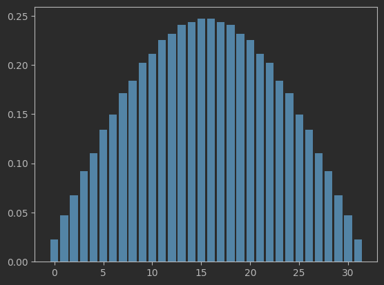

# Work Term 3 Report
This report will go over the topics that I researched as part of my Fall 23 NSERC USRA under the supervision of Dr. Nikitas Dimopoulos.

I spent the first part of my work term looking into software to simulate quantum circuits and quantum systems. I decided to focus on learning PennyLane, which is a Python library that allows for the development of quantum circuits. These circuits can either be run on a real quantum computer, or simulated. PennyLane offers tutorials and documentation for the library which greatly aided my ability to feel comfortable using the software.

Quantum computing has promising applications in being able to simulate quantum systems. Take a quantum system like a molecule. The interactions within the molecule can be reflected within a quantum computer by a series of quantum gates. And there are algorithms that will work on circuits with a low depth and low number of gates. These are called Noisy Intermediate Scale Quantum (NISQ) devices.

After some work getting familiar with PennyLane and the problem of approximating ground states of molecules, I wrote up a guide to follow along with my work. It has been replicated below.

# Variational Quantum Eigensolver
An implementation and guide for creating a variational quantum eigensolver (VQE).

This guide will focus on approximating the ground state of a hydrogen anion,
also known as hydride. The PennyLane website provides many
guides similar to this one on their demos page here: https://pennylane.ai/qml/demonstrations

## VQE
In the following demonstration of code, we will try and
model the molecular properties of a hydrogen anion
using a quantum circuit with variable parameters.
These parameters will be tuned in order to try and
minimize the cost function, which in this case is the energy
of a molecule in a given state. By determining the parameters
that minimize the cost function, we will have found an
estimation for the ground state of the molecule.

## Basis Sets
The basis set is chosen as a way to mathematically represent
the atomic orbital of a molecule. The two choices we consider
are the sto-3g, and cc-pvdz basis. The sto-3g basis is much
less expensive to compute with, at the cost of accuracy.
We will see that for the case of hydride, a better basis
set approximation is needed and the cc-pvdz set provides
a suitable approximation.

# Building the Circuit
## Hamiltonian Creation
To begin, we will create a hamiltonian of our molecule using
qchem.molecular_hamiltonian. Recall that a hydride molecule
consists of a hydrogen atom and two electrons. The single hydrogen
is listed within the `symbols` variable. The `coordinates` variable holds the position
of each symbol in 3D-space. For simplicity the hydrogen atom is located at `x=0, y=0, z=0`.
The charge of `-1` is due to there being a net charge of `-2 + 1 = -1` from the
two electrons and one proton. The cc-pvdz basis set was chosen for its increased accuracy that is needed
when evaluating the cost function.
~~~python
import pennylane as qml
from pennylane import qchem
from pennylane import numpy as np

symbols = ["H"]
coordinates = np.array([0.0, 0.0, 0.0])

Hamiltonian, qubits = qml.qchem.molecular_hamiltonian(symbols, coordinates, charge=-1, basis="cc-pvdz")
~~~

To view the hamiltonian and number of qubits needed, simply add some print statements

~~~python
print("# of qubits needed: ", qubits)
print(Hamiltonian)
~~~
## Circuit Creation
The device is created with the call to `qml.device`, and
the number of electrons and provided to create the Hartree-Fock (HF)
state. The HF state can be viewed as an approximate ground state.
~~~python
dev = qml.device("lightning.qubit", wires=qubits)

electrons = 2
hf = qml.qchem.hf_state(electrons, qubits)
~~~
The parameters that we will be tuning are inputs to the Givens rotation.
In short, this is a unitary operation on the circuit that models the excitation of electrons.
PennyLane has a tutorial on the Givens rotation that can be found here: https://pennylane.ai/qml/demos/tutorial_givens_rotations.

We can then define the circuit with the possible Givens rotations when defining the `circuit`, and calculate
the expectation value of the state with `cost_fn`.
~~~python
def circuit(theta, wires):
    #qml.BasisState(hf, wires=wires)
    qml.AllSinglesDoubles(weights=theta, wires=wires, hf_state=hf, singles=singles, doubles=doubles)

@qml.qnode(dev, interface="autograd")
def cost_fn(theta):
    circuit(theta, wires=range(qubits))
    return qml.expval(Hamiltonian)
~~~

# Optimization
The optimization of these parameters is done classically using gradient descent.
The code for this section is similar to the PennyLane demo found here: https://pennylane.ai/qml/demos/tutorial_vqe.
~~~python
energy = [cost_fn(theta)]
angle = [theta]

max_iterations = 100
conv_tol = 1e-06

for n in range(max_iterations):
    theta, prev_energy = opt.step_and_cost(cost_fn, theta)

    energy.append(cost_fn(theta))
    angle.append(theta)

    conv = np.abs(energy[-1] - prev_energy)

    if n % 2 == 0:
        print(f"Step = {n},  Energy = {energy[-1]:.8f} Ha")

    if conv <= conv_tol:
        break

print("\n" f"Final value of the ground-state energy = {energy[-1]:.8f} Ha")
print("\n" f"Optimal value of the circuit parameter = {angle[-1]}")
~~~

After 19 iterations we converge to the final ground-state energy. `Final value of the ground-state energy = -0.46985398 Ha`.

# Variational Quantum Eigensolver - Infinite Potential Well

After working through VQE for a molecule, Dr. Dimopoulos suggested further investigation into even simpler quantum systems. I wanted to take the infinite potential well and solve for an approximate minimum energy eigenstate. This would be analogous to taking the hydrogen potential, and solving for an approximate ground state.

This exercise was helpful in strengthening my understanding of the theory behind quantum mechanic computations. When working with PennyLane a lot of the hard work was being hidden under easy to use function calls and library features. The code below works through constructing a hamiltonian for the infinite potential well and then uses VQE to solve for the minimum energy eigenstate. Since we can solve for the eigenstates by hand, we then compare the approximate eigenstate to what we would expect.

The problem is to take a normalized vector, and apply rotations in such a way that the measured quantum state reflects the amplitude of the eigenfunction along discrete points. The rotations are applied based on gradient descent of the cost function.
~~~python
num_features = 2 ** number_of_qubits
features = np.ones(num_features, requires_grad=True)

stepsize = .4
max_iterations = 200
opt = qml.GradientDescentOptimizer(stepsize=stepsize)

for i in range(max_iterations):
    features, prev_energy = opt.step_and_cost(costfn, features)
    samples = costfn(features)
~~~
We then can plot the normalized feature vector to see what the VQE produced.

It looks very similar to what we would expect, so we would also like to get verify that the eigenvalue is close to pi^2. Indeed, when we solve for the eigen value we get a value of 9.5274 which approximates pi^2.

# Back to Hydrogen
After doing work with a much simpler quantum system, I tried to understand the computation being fone for the hydrogen VQE. A lot of which is easily missed when working with PennyLane's interface. My intial investigation was into the use of guassian functions to approximate the wavefunctions of atomic orbitals.

Below is a sample of my investigation that plots and compares the probability distributions of the analytical wave function and st0-3g basis set.

The wavefunctions for the atomic orbitals of a hydrogen atom are produced as python functions below.
~~~python
def psi_1s(x, y):
    r = np.sqrt(x**2 + y**2)
    return np.exp(-r / a0) / np.sqrt(np.pi * a0**3)

def psi_2s(x, y):
    r = np.sqrt(x**2 + y**2)
    return (1 - r / (2 * a0)) * np.exp(-r / (2 * a0)) / (4 * np.sqrt(2 * np.pi) * a0**3)

def psi_2p_z(x, y, z):
    r = np.sqrt(x**2 + y**2 + z**2)
    return (z / a0) * np.exp(-r / (2 * a0)) / (8 * np.sqrt(np.pi) * a0**5)
~~~

